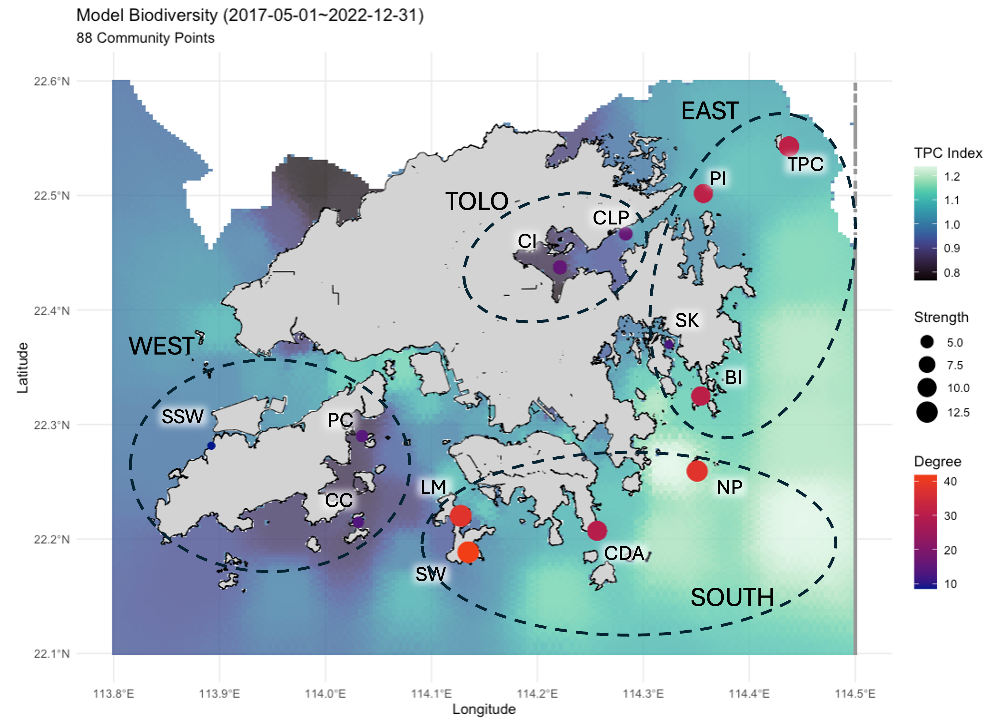

# From Local Stressors to Regional Sources: Eutrophication and Connectivity Shape a Coastal Metacommunity

#### author list hidden for double-anonymised review 

## Abstract 

 

Coastal urbanization exposes marine ecosystems to nutrient pollution via wastewater and urban runoff. Yet, how eutrophication shapes benthic metacommunities over the complex hydrological network inherent to coastal seas remains poorly understood. Here, we integrated 6 years of biodiversity data from 88 standardized biodiversity samplers (ARMS) with high-resolution water quality records across a tropical eutrophic urban coast. Chlorophyll-a concentration—a proxy for nutrient enrichment—was negatively correlated with normalized benthic richness, and explained 21.4% of compositional variation along the primary ordination axis. OTU richness and community evenness are not independent, as richness increased, communities underwent systematic restructuring: the relative richness of benthic primary producers (Bacillariophyta, Rhodophyta) increased with total OTU richness (R² = 0.21), while that of Annelida declined (R² = 0.60)—driving a significant increase in community evenness (R² = 0.72). Geographic distance, however, emerged as the predominant driver of community structure, with more than triple the effect size of chlorophyll‑a. Network analysis further clustered the 88 communities into four distinct modules, with 93.2% of communities matching their predefined region. A highly connected 'biodiversity corridor' in the south and east was identified, characterized by low chlorophyll-a levels and high network centrality, harbored all putative source communities. In contrast, isolated sinks in the west and Tolo Harbor exhibited low richness and connectivity. Our findings demonstrated that eutrophication and spatial connectivity jointly structure coastal metacommunities, identifying source-sink dynamics critical for conservation. This framework offers a transferable template for diagnosing and managing metacommunity health in urbanized coastal seascapes globally. 

## Table of Contents

### Supporting Materials 
  1. [Raw sequence](https://doi.org/10.6084/m9.figshare.29481053) 
  2. [Data](3_data)
  3. [Figures](2_figure/260304_mergeFigure.pdf)
  4. [Tables](2_figure/260304_mergeTable.pdf)
  5. [Supplementary Materials](2_figure/260305_supplementaryMaterials_FIN.pdf)

### Sequence processing pipeline 
1. [Import & cutadap](https://github.com/zhongyuewan/MGEXP1/blob/main/1_code/1.1_importAndCutAdapt.sh): import raw sequence data (.fastq) into Qiime artefacts (.qza) and remove PCR adaptors.
2. [Denoise-paired](https://github.com/zhongyuewan/MGEXP1/blob/main/1_code/1.2_denoiseAndPair.sh): remove sequences likely induced by error and merge the reverse/forward reads.
3. [Decontam](https://github.com/zhongyuewan/MGEXP1/blob/main/1_code/1.3_decontam.r): a process to look into the negative control and remove sequences that might have come from sample contamination.
4. [Amino Acid translation](https://github.com/zhongyuewan/MGEXP1/blob/main/1_code/1.4_aaTranslate.r): translate DNA sequence into amino acid and remove sequences with one of the following conditions: 1) any STOP codon, 2) >3 deletion, 3) any frameshift, 4) any insertion.
5. [Cluster all sequences](https://github.com/zhongyuewan/MGEXP1/blob/main/1_code/1.5_clusterReads.sh) by 97% similarity into operational taxonomic units (OTUs) for downstream data analysis.
6. [Taxonomic assignment](https://github.com/zhongyuewan/MGEXP1/blob/main/1_code/1.6_taxAssign.sh) with BLAST against two different libraries: 1) McIlroy et al. 2024 & 2) Medori2 (GB260).

### Data Analysis 
1. Environmental data
   - [Heatmap](https://github.com/zhongyuewan/MGEXP1/blob/main/1_code/2.1_eData_heatmap.r) (Figure 1d, Table 1)
   - [MPA east vs west](https://github.com/zhongyuewan/MGEXP1/blob/main/1_code/2.2_eastVSwest.r) (Table S2)
2. Species richness by ARMS 
   - [Merge richness from all three fractions](https://github.com/zhongyuewan/MGEXP1/blob/main/1_code/2.3_combinFractionbyARMS.r) (Table S1)
   - [Environmental data ~ species richness](https://github.com/zhongyuewan/MGEXP1/blob/main/1_code/2.4_eDATAvsRichness.r) (Table 2) 
3. Community composition
   - [PCoA](https://github.com/zhongyuewan/MGEXP1/blob/main/1_code/2.5_PCoA.r) (Figure 2)
   - [Permutational Multivariate Analysis of Variance (adonis2)](https://github.com/zhongyuewan/MGEXP1/blob/main/1_code/2.6_adonis2.r) 
   - [Diverging Bar Chart & Chi-Square analysis](https://github.com/zhongyuewan/MGEXP1/blob/main/1_code/2.8_sidewayBar.r) (Figure 3)

     
